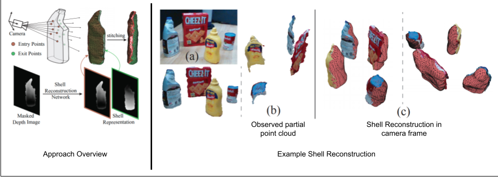

# Shell Reconstruction
This repository provides the source code, trained model and instructions for using shell reconstruction.

Shell reconstruction is a novel method for 3D shape reconstruction which models the object geometry as a pair of depth images, composing the "shell" of the object. This unique representation allows using image-to-image residual ConvNet architectures for 3D reconstruction, generates object reconstruction directly in the camera frame, and generalizes well to novel object types. Moreover, an object shell can be converted into an object mesh in a fraction of a second, providing time and memory efficient alternative to voxel or implicit representations. Please visit our [arxiv paper](https://arxiv.org/abs/2109.06837) for more details.




## Setup
- Install [git-lfs](https://git-lfs.github.com/)
- Clone the repository
- Setup python environment as following
```
python3.6 -m venv env
source env/bin/activate
pip install --upgrade pip
pip install -r requirements.txt
```

## Usage API
Given a masked depth image of the target object and the camera intrinsics matrix, shell reconstruction can be invoked in the following way:
```python
from shell.reconstructor import ShellReconstructor
reconstructor = ShellReconstructor()
np_pcd = reconstructor.reconstruct(masked_depth, camera_k)
```
Please look at the [reconstructor](shell/reconstructor.py) file for more details on input parameters and output.

## Demo
We provide real-world scene information ([demo_data/real_data.pkl](demo_data/real_data.pkl)) captured using Intel RealSense RGBD camera. You can see shell-reconstruction demo on this data by running:
```
python demo.py
```
This file will generate reconstructions in `demo_data/reconstruction` folder (we also provide expected output in [demo_data/reconstruction_expected](demo_data/reconstruction_expected) folder). 

## GAIC MQTT Compatability Demo
[run_shell_mqtt_service.py](run_shell_mqtt_service.py) implements shell reconstruction as mqtt service in GAIC compliant way.
[demo_shell_mqtt_service.py](demo_shell_mqtt_service.py) demonstrates using this service.
For demo:
- Install mqtt libraries:
  ```bash
  sudo apt install libmosquitto-dev
  sudo apt install mosquitto
  ```
- Install srl libraries inside the python environment
  ```bash
  pip install srl.core srl.mqtt srl.service srl.zmq --extra-index-url https://art.sec.samsung.net/artifactory/saic-ny_pypi/ --trusted-host art.sec.samsung.net --upgrade
  ```
- Run mqtt broker listening at port `5678`:
  ```bash
  mosquitto -p 5678
  ```
- In separate terminal session, run shell mqtt service (replace `<broker_ip_addr>` with the ip address of the broker):
  ```bash
  python run_shell_mqtt_service.py \
    --broker_address <broker_ip_addr> \
    --broker_port 5678 \
    --shell_reconstruction_reqres_topic_name shell_recon_reqres_topic
  ```
- In separate terminal session, run the demo script:
  ```bash
  python demo_shell_mqtt_service.py \
    --broker_address <broker_ip_addr> \
    --broker_port 5678 \
    --shell_reconstruction_reqres_topic_name shell_recon_reqres_topic
  ```
- Once done, shell reconstruction results for [demo_data/real_data.pkl](demo_data/real_data.pkl) can be found inside the `demo_data/reconstruction_gaic_mqtt` folder.

## ROS2 Node:
For running shell-reconstruction as a ROS2 node, please have a look at [shell-reconstruction-ros repository](https://gitlab.saicny.com/submagr/shell-reconstruction-ros).
## Dataset Generation
Coming soon.

## Training
Coming soon.

## Citation
```
@article{chavan2021object,
  title={Object Shell Reconstruction: Camera-centric Object Representation for Robotic Grasping},
  author={Chavan-Dafle, Nikhil and Popovych, Sergiy and Agrawal, Shubham and Lee, Daniel D and Isler, Volkan},
  journal={arXiv preprint arXiv:2109.06837},
  year={2021}
}
```

## Acknowledgment
- [Colin Prepscius](mailto:colinprepscius@gmail.com) for extensive code review